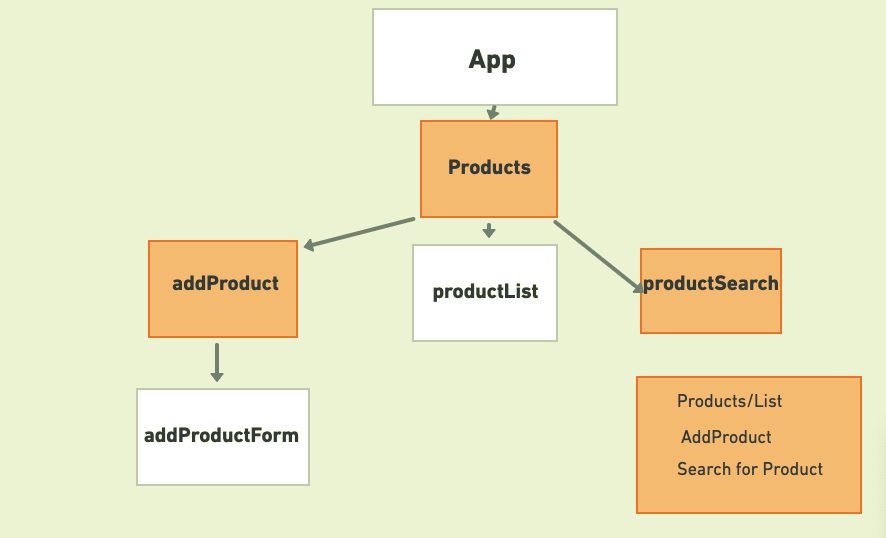

# Project Overview

This project is React implementation of ecommerce site using https://airtable.com/api

## Project Name

React Ecommerce-Backend-Inventory managment

## Project Description

In this project,React Ecommerce-Backend-Inventory managment application will be built in React JS, using https://airtable.com/api api design.

The client will be able to do the following:
-View list of product in the store/backend
-Able to add new product with image url
-Edit product

## Wireframes

<table align="center">
  <tr>
    <td align="center">Home Page</td>
    </tr>
  <tr>
    <td></td>
     </tr>
 </table>
 
 <table align="center">
  <tr>
    <td align="center">Product Information</td>
    </tr>
  <tr>
    <td></td>
     </tr>
 </table>
 
<table align="center">
  <tr>
    <td align="center">Backend</td>
    </tr>
  <tr>
    <td></td>
     </tr>
 </table>


Upload images of your wireframes to an image hosting site or add them to an assets folder 

<table align="center">
  <tr>
    <td align="center"> Component Hierarchy</td>
    </tr>
  <tr>
    <td></td>
     </tr>
 </table>

## API and Data Sample

```json
{
    "records": [
        {
            "id": "recUWgp8y9KdGjiaI",
            "fields": {
                "price": "30",
                "category": "Men Cloths",
                "qauntity": "10",
                "name": "Black Jack",
                "description": "Lorem ipsum dolor sit amet, consectetur adipiscing elit, sed do eiusmod tempor incididunt ut labore et dolore magna aliqua",
                "imgurl1": "https://i.imgur.com/aZtyu5b.jpg",
                "imageurl2": "https://i.imgur.com/aZtyu5b.jpg",
                "imgurl3": "https://i.imgur.com/aZtyu5b.jpg"
            },
            "createdTime": "2021-03-26T13:10:03.000Z"
        },
        {
            "id": "recNIie1gm7CsH70H",
            "fields": {
                "price": "40",
                "category": "Accessory",
                "qauntity": "20",
                "description": "Lorem ipsum dolor sit amet, consectetur adipiscing elit, sed do eiusmod tempor incididunt ut labore et dolore magna aliqua",
                "name": "Gloves",
                "imgurl1": "https://i.imgur.com/D4ZEz31.jpg",
                "imageurl2": "https://i.imgur.com/D4ZEz31.jpg",
                "imgurl3": "https://i.imgur.com/D4ZEz31.jpg"
            },
            "createdTime": "2021-03-26T13:10:03.000Z"
        },
        {
            "id": "recL5Lclb4v9qWsvs",
            "fields": {
                "price": "50",
                "category": "Men Cloths",
                "qauntity": "52",
                "name": "Hood Jack",
                "description": "Lorem ipsum dolor sit amet, consectetur adipiscing elit, sed do eiusmod tempor incididunt ut labore et dolore magna aliqua",
                "imgurl1": "https://i.imgur.com/l6ZuCB9.jpg",
                "imageurl2": "https://i.imgur.com/l6ZuCB9.jpg",
                "imgurl3": "https://i.imgur.com/l6ZuCB9.jpg"
            },
            "createdTime": "2021-03-26T13:10:03.000Z"
        }
    ],
    "offset": "recL5Lclb4v9qWsvs"
}

```

### MVP/PostMVP

#### MVP

-View list of product in the store/backend
-Able to add new product with image url
-Edit product

#### PostMVP

- Add authenticaton
- add stripe payment
- shipping
  -Able to add new product with images upload button
  -Delete product.

### On the the front end, customer/user will be able to do the following:

-1 View list of product in the store

#### PostMVP
-Add authenticaton
-Add stripe payment

## Project Schedule

| Day        | Deliverable                                        | Status     |
| ---------- | -------------------------------------------------- | ---------- |
| July 10-12 | Prompt / Wireframes / Priority Matrix / Timeframes | Incomplete |
| March 26   | Project Approval                                   | Incomplete |
| March 27   | Core Application Structure (HTML, CSS, etc.)       | Incomplete |
| March 28   | Pseudocode / actual code /apicall                  | Incomplete |
| March 29   | Initial Clickable Model                            | Incomplete |
| March 31   | MVP                                                | Incomplete |
| April 1    | css/styling/booststrap/                            | Incomplete |
| April 2    | Presentations                                      | Incomplete |

## Timeframes

| Component          | Priority | Estimated Time | Time Invested | Actual Time |
| ------------------ | :------: | :------------: | :-----------: | :---------: |
| Adding prduct Form |    H     |      3hrs      |               |             |
| Working with API   |    H     |      3hrs      |               |             |
| Total              |    H     |      6hrs      |               |             |

## SWOT Analysis

### Strengths:

I can put this together in using react using examples of what we have been doing in the class


### Weaknesses:

UI/styling and positioning of it tags is still a challenge for me

### Opportunities:

A chance for me to play with uploading images

A chance for me to play with uploading images

### Threats:

I don't see any threats here now
